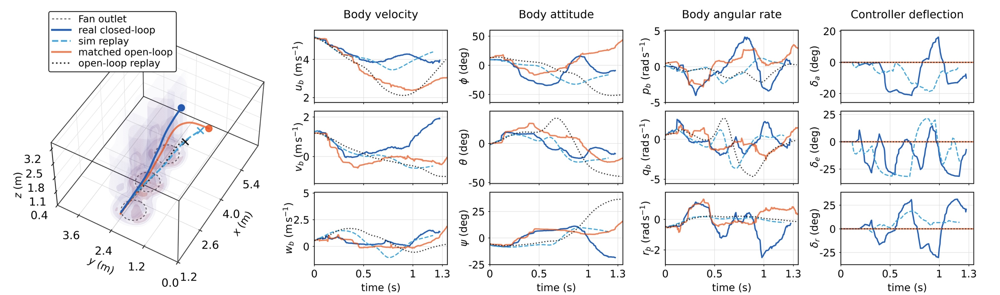
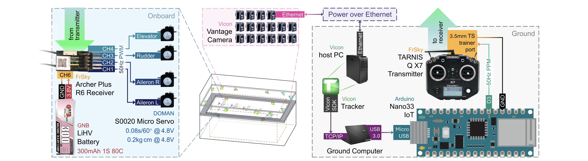
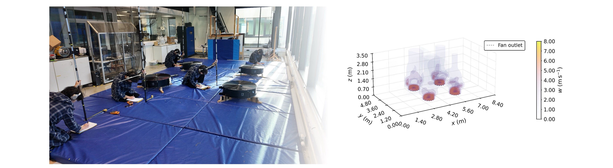
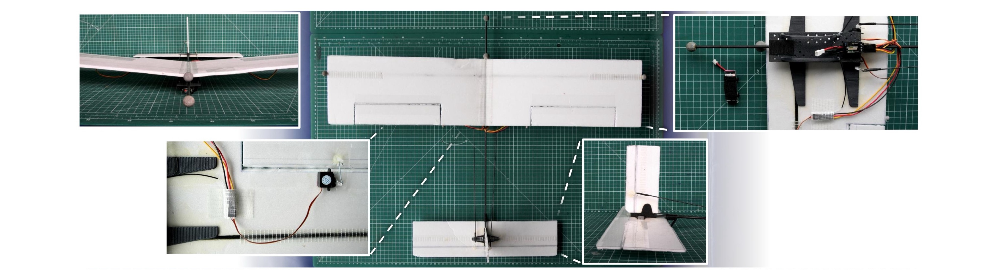
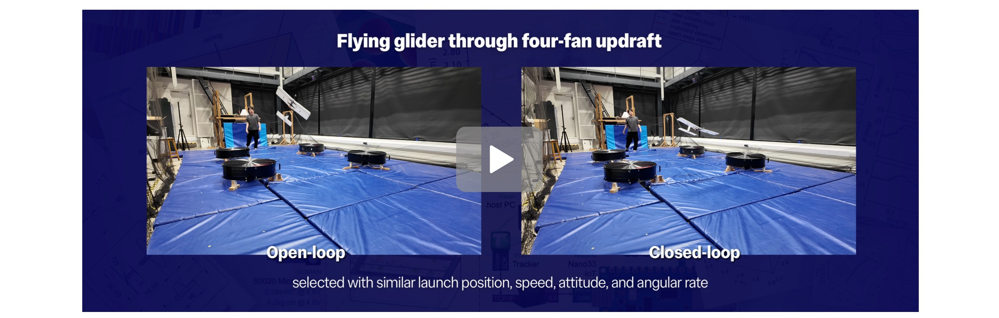
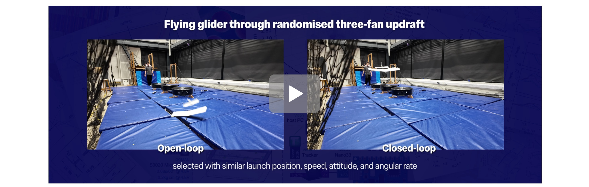
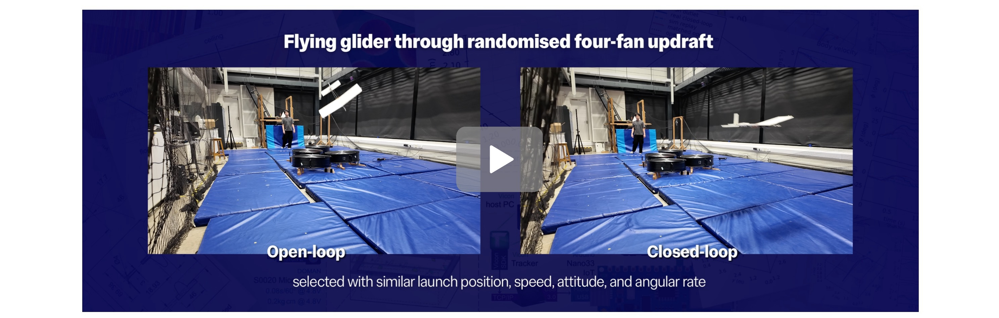
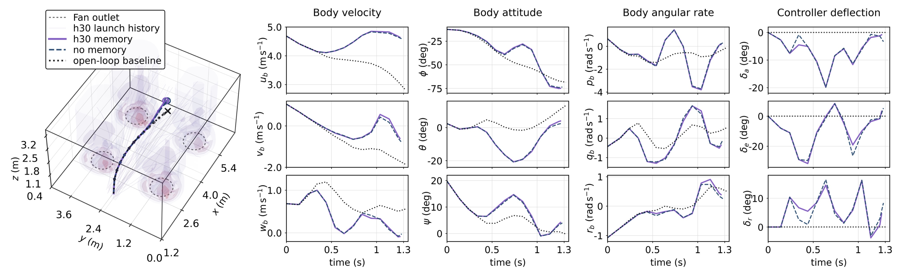

<p align="center">
  <sub>A thesis submitted to the Department of Aeronautics</sub><br>
  <sub>in partial fulfilment of the requirements for the degree of</sub><br>
  <sub>Master of Engineering (MEng) in Aeronautical Engineering</sub><br>
  <sub>at</sub><br>
  <sub>Imperial College London</sub><br>
</p>


<!--
Suggested optional README image assets. Add these later if desired, then uncomment the image blocks in the relevant sections.

assets/readme/overview.png                  # thesis roadmap, similar to Fig. 1.1
assets/readme/flight_arena_system.png       # Vicon / command / glider system architecture, similar to Fig. 3.4
assets/readme/updraft_surrogate.png         # measured and fitted updraft fields, similar to Figs. 4.8-4.10
assets/readme/glider_hardware.png           # manufactured fifth iteration glider, similar to Fig. 5.3
assets/readme/mission_geometry.png          # launch gate, safe volume, and exit face, similar to Fig. 6.1
assets/readme/random_layout_replay.png      # representative random fan layout replay, similar to Figs. 7.3-7.4
-->

<!--
Suggested optional README image assets. Add these later if desired, then uncomment the image blocks in the relevant sections.

assets/readme/overview.png                  # thesis roadmap, similar to Fig. 1.1
assets/readme/flight_arena_system.png       # Vicon / command / glider system architecture, similar to Fig. 3.4
assets/readme/updraft_surrogate.png         # measured and fitted updraft fields, similar to Figs. 4.8-4.10
assets/readme/glider_hardware.png           # manufactured fifth iteration glider, similar to Fig. 5.3
assets/readme/mission_geometry.png          # launch gate, safe volume, and exit face, similar to Fig. 6.1
assets/readme/random_layout_replay.png      # representative random fan layout replay, similar to Figs. 7.3-7.4
-->

<br>

<p align="center">
  <a href="LICENSE">
    <picture>
      <source media="(prefers-color-scheme: dark)" srcset="https://img.shields.io/badge/License-MIT-ff1423?style=for-the-badge&labelColor=0d1117">
      <source media="(prefers-color-scheme: light)" srcset="https://img.shields.io/badge/License-MIT-750014?style=for-the-badge&labelColor=ffffff">
      
    </picture>
  </a>
  <picture>
    <source media="(prefers-color-scheme: dark)" srcset="https://img.shields.io/badge/Python-3.12-FFE873?style=for-the-badge&labelColor=0d1117">
    <source media="(prefers-color-scheme: light)" srcset="https://img.shields.io/badge/Python-3.12-306998?style=for-the-badge&labelColor=ffffff">
    
  </picture>
  <picture>
    <source media="(prefers-color-scheme: dark)" srcset="https://img.shields.io/badge/MATLAB-R2026a-fd8000?style=for-the-badge&labelColor=0d1117">
    <source media="(prefers-color-scheme: light)" srcset="https://img.shields.io/badge/MATLAB-R2026a-006da8?style=for-the-badge&labelColor=ffffff">
    
  </picture>
  <picture>
    <source media="(prefers-color-scheme: dark)" srcset="https://img.shields.io/badge/Status-Thesis%20Release-ffff00?style=for-the-badge&labelColor=0d1117">
    <source media="(prefers-color-scheme: light)" srcset="https://img.shields.io/badge/Status-Thesis%20Release-0000cd?style=for-the-badge&labelColor=ffffff">
    
  </picture>
</p>

<br>

## About

Nausicaa is a reproducible research repository for an indoor fixed-wing sim-to-real flight experiment. The project studies whether a small hand-launched glider can use a controller developed in simulation to repeatedly cross an indoor flight volume containing uncertain updrafts.

The controller uses **viability-guided manoeuvre primitive selection**: instead of tracking one preplanned trajectory, the glider repeatedly chooses short validated manoeuvres every `0.10 s` that keep the flight state viable under uncertain lift.

<p align="center">
  <br>
  <sup><em>Example result: closed-loop control keeps the glider flying through uncertain updrafts, while a comparable open-loop launch fails.</em></sup>
</p>

The repository links the measured flight arena, manufactured glider, updraft models, controller development ladder, frozen controller inputs, real-flight logs, and simulation replay diagnostics behind the thesis.

For academic citation, please cite the latest version on arXiv:

```bibtex
@misc{li2026nausicaa,
  title         = {Viability-Guided Sim-to-Real Transfer for a Small Fixed-Wing Glider in Uncertain Indoor Updrafts},
  author        = {Li, Hanchen},
  year          = {2026},
  eprint        = {TBA},
  archivePrefix = {arXiv},
  primaryClass  = {cs.RO},
  note          = {Public thesis manuscript; MEng thesis, Department of Aeronautics, Imperial College London}
}
````

 A direct citation is also avaliable when a thesis-format reference is required.
 
```bibtex
@mastersthesis{li2026nausicaa_thesis,
  title  = {Viability-Guided Sim-to-Real Transfer for a Small Fixed-Wing Glider in Uncertain Indoor Updrafts},
  author = {Li, Hanchen},
  school = {Imperial College London},
  year   = {2026},
  type   = {MEng thesis},
  note   = {Department of Aeronautics}
}
```

For the software, datasets, and reproducibility materials, please cite the Zenodo archive:

```bibtex
@software{li2026nausicaa_repository,
  title   = {Nausicaa: Reproducibility Package for Viability-Guided Sim-to-Real Fixed-Wing Glider Flight},
  author  = {Li, Hanchen},
  year    = {2026},
  version = {v2026.06-thesis},
  url     = {https://github.com/GH-X-ST/Nausicaa},
  doi     = {TBA}
}
```
---

## Workflow at a Glance

- **A repeatable indoor flight problem.**  
  The project turns uncertain outdoor lift exploitation into a controlled laboratory experiment. A small hand-launched glider must cross a bounded indoor flight volume while fan-generated updrafts can either help it stay aloft or push it toward failure.

- **A complete experimental workflow, not just a controller.**  
  The repository includes the pieces needed to make the flight tests repeatable: Vicon motion capture, offboard computation, a radio-control command path, measured sensing and actuator delays, a safety-bounded arena, and the manufactured glider.
<p align="center">
  <br>
  <sup><em>Selected flight test sensing, computation, and command architecture.</em></sup>
</p>

- **A measured but imperfect updraft model.**  
  The indoor flow is not assumed to be an ideal wind field. Fan-generated updrafts are measured with a scanned hot-wire anemometer, fitted with compact surrogate models, and then randomised during controller development so the final controller is not tuned to one specific flow map.
<p align="center">
  <br>
  <sup><em>Time-lapse composite of anemometer measurements and harmonic annular Gaussian model with GP residual correction.</em></sup>
</p>

- **A real glider model connected to the hardware.**  
  The simulation model is built around the manufactured aircraft. It uses measured mass properties, centre of gravity, actuator timing, flight calibration data, and panelwise aerodynamic loading to capture the main behaviour of the glider while remaining fast enough for large validation runs.
<p align="center">
  <br>
  <sup><em>Manufactured fifth iteration glider and key assembly details.</em></sup>
</p>

- **Control by short tested manoeuvres.**  
  The controller repeatedly selects `0.10 s` manoeuvre primitives in flight. Each primitive has already been simulated and labelled with its entry conditions, likely exit outcome, failure risk, safety margin, lift exposure, energy change, and timing cost.

- **A flight-ready controller library.**  
  The dense primitive library is compressed into a smaller set of representative validated manoeuvres. This keeps the online controller fast enough for real flight while avoiding the creation of synthetic controllers that were never tested.

- **Real flight transfer beyond the validation cases.**  
  The final tests compare open-loop and closed-loop flight in still air, fixed fan layouts, and randomised fan layouts. In the random layouts that were not used during controller validation, closed-loop control substantially improves mission success over open-loop flight.

<p align="center">
  <a href="https://github.com/user-attachments/assets/d4a86b25-39f0-4fcc-bbba-5313a1fb1c9b">
    
  </a>
  <a href="https://github.com/user-attachments/assets/89417fed-ad15-4e5b-b527-6ba1ec1c0ea1">
    
  </a>
  <a href="https://github.com/user-attachments/assets/73b79e11-a070-430c-9abe-ae00ba1c4b7a">
    
  </a>
  <sup><em>Representative flight-test cases. Click each image to open the video.</em></sup>
</p>

- **A clear limit on what did not help much.**  
  The repository also includes the spatial memory component and its logs, but the evidence shows that memory is not the main reason the system transfers. The main reusable result is the measured workflow plus the viability-guided primitive controller.
<p align="center">
  <br>
  <sup><em>Example result: both the memory and no-memory flights survive and exploit the updrafts; the memory component has limited effect.</em></sup>
</p>

---

## Setup and Reproducibility

This repository is a workflow archive for the thesis. The folders correspond to the main parts of the experiment: updraft modelling, glider design, controller validation, timing tests, and simulation replay of the flight tests.

### Tested environment

| Tool | Tested version |
|---|---|
| Windows | 11 25H2 |
| Python | 3.12.11 |
| MATLAB | R2026a |
| Arduino IDE | 2.3.8 |
| Vicon Tracker | 3.9 |

### Clone

Full clone:

```powershell
git clone https://github.com/GH-X-ST/Nausicaa.git
cd Nausicaa
```

Please use partial clone and sparse checkout for lighter inspection. For example, to inspect only the controller and flight-test folders:

```powershell
git clone --filter=blob:none --sparse https://github.com/GH-X-ST/Nausicaa.git
cd Nausicaa
git sparse-checkout set README.md 03_Control 04_Flight_Test
```

Change the final `git sparse-checkout set ...` line to select other folders.

### Local environment

This repository does not currently provide a single root dependency file for the whole workflow. Therefore, you have to create a local Python environment first, then install only the packages required by the scripts you intend to run.

```powershell
py -3.12 -m venv .venv
.\.venv\Scripts\Activate.ps1
python -m pip install --upgrade pip
```

If PowerShell blocks virtual environment activation, call the environment interpreter directly:

```powershell
.\.venv\Scripts\python.exe -m pip install --upgrade pip
```

MATLAB, Arduino IDE, Vicon Tracker, and Flight Arena hardware are only needed for the workflows that depend on them. Most readers should start by inspecting the released data, figures, logs, and scripts before attempting any rerun.

### Workflow entry points

Use the thesis chapter or appendix to choose the relevant repository folder:

| Thesis part | Repository folder |
|---|---|
| Chapter 3: system architecture and timing | `B_Test_Lantency/`, `C_Overall_Latency/`, `04_Flight_Test/` |
| Chapter 4: updraft characterisation and modelling | `01_Thermal/` |
| Chapter 5: glider design and manufacture | `02_Glider_Design/` |
| Chapter 6: controller design and validation | `03_Control/` |
| Chapter 7: real-flight transfer and replay | `04_Flight_Test/` |
| Appendix A: reproducibility and version record | this README |
| Appendices B-G: supplementary results | Corresponding workflow folders above |

### Reproducibility boundary

| Evidence type | Repository folder | Boundary |
|---|---|---|
| Updraft modelling | `01_Thermal/` | Repeating the physical flow measurement requires the fan and anemometer setup. |
| Glider design | `02_Glider_Design/` | The physical aircraft depends on manufacturing tolerances and assembly. |
| Controller validation | `03_Control/` | Dense simulation and validation sweeps may be computationally expensive. |
| Real-flight transfer | `04_Flight_Test/` | Physical experiments cannot be exactly repeated from software alone. |
| Timing tests | `B_Test_Lantency/`, `C_Overall_Latency/` | Repeating the measurements requires the corresponding hardware setup. |

Do not run dense simulations, archive regeneration, or hardware-facing scripts unless you want to regenerate those artefacts.

### License

The released software code is distributed under the MIT License. See [LICENSE](LICENSE) for details.

The thesis manuscript, media, experimental data, third-party material, and generated figures may be subject to separate copyright or repository notices. Do not assume that the MIT License applies to every non-code artefact unless it is explicitly released under the same license.

---

## Stargazers Over Time
[](https://starchart.cc/GH-X-ST/Nausicaa#gh-light-mode-only)
[](https://starchart.cc/GH-X-ST/Nausicaa#gh-dark-mode-only)
