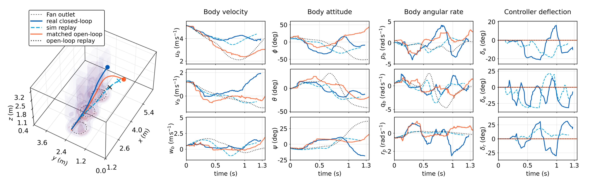
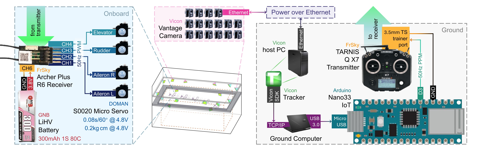
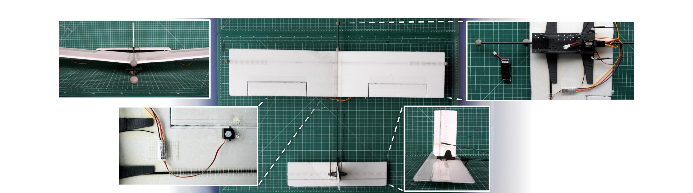

<p align="center">
  <sub>A thesis submitted to the Department of Aeronautics</sub><br>
  <sub>in partial fulfilment of the requirements for the degree of</sub><br>
  <sub>Master of Engineering (MEng) in Aeronautical Engineering</sub><br>
  <sub>at</sub><br>
  <sub>Imperial College London</sub><br>
</p>


<!--
Suggested optional README image assets. Add these later if desired, then uncomment the image blocks in the relevant sections.

assets/readme/overview.png                  # thesis roadmap, similar to Fig. 1.1
assets/readme/flight_arena_system.png       # Vicon / command / glider system architecture, similar to Fig. 3.4
assets/readme/updraft_surrogate.png         # measured and fitted updraft fields, similar to Figs. 4.8-4.10
assets/readme/glider_hardware.png           # manufactured fifth iteration glider, similar to Fig. 5.3
assets/readme/mission_geometry.png          # launch gate, safe volume, and exit face, similar to Fig. 6.1
assets/readme/random_layout_replay.png      # representative random fan layout replay, similar to Figs. 7.3-7.4
-->

<!--
Suggested optional README image assets. Add these later if desired, then uncomment the image blocks in the relevant sections.

assets/readme/overview.png                  # thesis roadmap, similar to Fig. 1.1
assets/readme/flight_arena_system.png       # Vicon / command / glider system architecture, similar to Fig. 3.4
assets/readme/updraft_surrogate.png         # measured and fitted updraft fields, similar to Figs. 4.8-4.10
assets/readme/glider_hardware.png           # manufactured fifth iteration glider, similar to Fig. 5.3
assets/readme/mission_geometry.png          # launch gate, safe volume, and exit face, similar to Fig. 6.1
assets/readme/random_layout_replay.png      # representative random fan layout replay, similar to Figs. 7.3-7.4
-->

<br>

<p align="center">
  <a href="LICENSE">
    <picture>
      <source media="(prefers-color-scheme: dark)" srcset="https://img.shields.io/badge/License-MIT-ff1423?style=for-the-badge&labelColor=0d1117">
      <source media="(prefers-color-scheme: light)" srcset="https://img.shields.io/badge/License-MIT-750014?style=for-the-badge&labelColor=ffffff">
      
    </picture>
  </a>
  <picture>
    <source media="(prefers-color-scheme: dark)" srcset="https://img.shields.io/badge/Python-3.12-FFE873?style=for-the-badge&labelColor=0d1117">
    <source media="(prefers-color-scheme: light)" srcset="https://img.shields.io/badge/Python-3.12-306998?style=for-the-badge&labelColor=ffffff">
    
  </picture>
  <picture>
    <source media="(prefers-color-scheme: dark)" srcset="https://img.shields.io/badge/MATLAB-R2026a-fd8000?style=for-the-badge&labelColor=0d1117">
    <source media="(prefers-color-scheme: light)" srcset="https://img.shields.io/badge/MATLAB-R2026a-006da8?style=for-the-badge&labelColor=ffffff">
    
  </picture>
  <picture>
    <source media="(prefers-color-scheme: dark)" srcset="https://img.shields.io/badge/Arduino%20IDE-2.3.8-00979D?style=for-the-badge&labelColor=0d1117">
    <source media="(prefers-color-scheme: light)" srcset="https://img.shields.io/badge/Arduino%20IDE-2.3.8-00979D?style=for-the-badge&labelColor=ffffff">
    
  </picture>
  <picture>
    <source media="(prefers-color-scheme: dark)" srcset="https://img.shields.io/badge/Status-Thesis%20Release-ffff00?style=for-the-badge&labelColor=0d1117">
    <source media="(prefers-color-scheme: light)" srcset="https://img.shields.io/badge/Status-Thesis%20Release-0000cd?style=for-the-badge&labelColor=ffffff">
    
  </picture>
</p>

<br>

## Overview

Nausicaa is a reproducible research repository for an indoor fixed-wing sim-to-real flight experiment. The project studies whether a small hand-launched glider can use a controller developed in simulation to repeatedly cross an indoor flight volume containing uncertain fan-generated updrafts.

The controller is built around **viability-guided manoeuvre primitive selection**. Instead of tracking one long planned trajectory through an uncertain flow field, the glider selects short stabilised manoeuvre primitives every `0.10 s`. Each primitive is generated and validated offline. Online selection then uses stored evidence about entry compatibility, continuation probability, hard-failure risk, safety margin, useful lift exposure, energy change, and timing feasibility.
<p align="center">
  <br>
  <sup><em>Closed-loop control helps the glider flying through the uncertain updrafts, while the open-loop case fails and the simulation replay shows a visible reality gap.</em></sup>
</p>
This repository accompanies the thesis:

```text
Hanchen Li. Viability-Guided Sim-to-Real Transfer for a Small Fixed-Wing Glider in Uncertain Indoor Updrafts.
MEng thesis, Department of Aeronautics, Imperial College London, 2026.
````
Nausicaa is organised as a workflow archive. It contains source code, configuration files, processed datasets, calibration artefacts, frozen controller inputs, plotting scripts, measurement logs, and reproduce instructions.


## Highlights

- **A repeatable indoor flight problem.**  
  The project turns uncertain outdoor lift exploitation into a controlled laboratory experiment. A small hand-launched glider must cross a bounded indoor flight volume while fan-generated updrafts can either help it stay aloft or push it toward failure.

- **A complete experimental workflow, not just a controller.**  
  The repository includes the pieces needed to make the flight tests repeatable: Vicon motion capture, offboard computation, a radio-control command path, measured sensing and actuator delays, a safety-bounded arena, and the manufactured foam/carbon glider.
<p align="center">
  <br>
  <sup><em>Selected flight test sensing, computation, and command architecture.</em></sup>
</p>
<p align="center">
  <br>
  <sup><em>Manufactured fifth iteration glider and key assembly details.</em></sup>
</p>

- **A measured but imperfect updraft model.**  
  The indoor flow is not assumed to be an ideal wind field. Fan-generated updrafts are measured with a scanned hot-wire anemometer, fitted with compact surrogate models, and then randomised during controller development so the final controller is not tuned to one perfect flow map.

- **A real glider model connected to the hardware.**  
  The simulation model is built around the manufactured aircraft rather than an abstract vehicle. It uses measured mass properties, centre of gravity, actuator timing, flight calibration data, and panelwise aerodynamic loading to capture the main behaviour of the glider while remaining fast enough for large validation runs.

- **Control by short tested manoeuvres.**  
  Instead of planning one long trajectory through an uncertain flow field, the controller repeatedly chooses short `0.10 s` manoeuvre primitives. Each primitive has already been simulated and labelled with its entry conditions, likely exit outcome, failure risk, safety margin, lift exposure, energy change, and timing cost.

- **A flight-ready controller library.**  
  The dense primitive library is compressed into a smaller set of representative validated manoeuvres. This keeps the online controller fast enough for real flight while avoiding the creation of synthetic controllers that were never tested.

- **Real flight transfer beyond the validation cases.**  
  The final tests compare open-loop and closed-loop flight in still air, fixed fan layouts, and randomised fan layouts. In the random layouts that were not used during controller validation, closed-loop control substantially improves mission success over open-loop flight.

- **A clear limit on what did not help much.**  
  The repository also includes the spatial memory component and its logs, but the evidence shows that memory is not the main reason the system transfers. The main reusable result is the measured workflow plus the viability-guided primitive controller.


## Main results

| Result | Value |
|---|---:|
| Final mission simulations | 36,000 runs |
| Executed simulated primitive segments | 384,795 segments |
| Dense speed-bin primitive variants | 1,605 |
| Held-out primitive validation replays | 256,800 replays |
| Balanced deployment library size | 112 primitive variants |
| Mean candidates evaluated by balanced library | 7.0 candidates |
| Mean selector time for balanced library | 50.9 ms |
| Balanced decisions within 0.100 s primitive horizon | 85.2% |
| Real flight attempts completed by the glider platform | 1,042 launch attempts |

The strongest transfer evidence comes from random fan layouts that were not included in the held-out simulation validation ladder:

| Layout | Open-loop exit-face rate | Closed-loop exit-face rate | Closed-loop with memory |
|---|---:|---:|---:|
| Random three-fan layout | 30.0% | 86.7% | 70.0% |
| Random four-fan layout | 20.0% | 93.3% | 90.0% |

Spatial memory should be interpreted carefully. In this experiment it is a bounded diagnostic / architectural component rather than the main transfer mechanism. In simulation it changed fewer than 10% of selections and gave little aggregate benefit; in real flight it did not form a separate success case and sometimes reduced exit-face reliability.

## What you can do with this repository

| Task | Where to start |
|---|---|
| Inspect the thesis workflow and project context | `README.md`, thesis PDF / arXiv record, folder-level notes |
| Reproduce or inspect updraft characterisation and surrogate fits | `01_Thermal/` |
| Inspect glider sizing, optimisation, manufacture, and mass properties | `02_Glider_Design/` |
| Reproduce controller development, validation, compression, and plotting | `03_Control/` |
| Inspect real flight logs, replay diagnostics, and post-processing | `04_Flight_Test/` |
| Inspect component and end-to-end latency tests | `B_Test_Lantency/`, `C_Overall_Latency/` |
| Review project documentation and release notes | `docs/` |

## Repository layout

```text
Nausicaa/
├── 01_Thermal/                 # fan updraft measurement, processing, and surrogate modelling
├── 02_Glider_Design/           # glider sizing, optimisation, CAD-style design records, and manufacture data
├── 03_Control/                 # glider model, SysID, primitive library, validation ladder, governor, and plotting
├── 04_Flight_Test/             # real flight runtime records, flight logs, replay diagnostics, and figures
├── A_Miscellaneous/            # supplementary and supporting project material
├── B_Test_Lantency/            # component latency tests; spelling retained from repository history
├── C_Overall_Latency/          # command path and end-to-end timing analysis
├── docs/                       # project notes, release notes, and supporting documentation
├── requirements.txt            # base Python dependencies
├── requirements-design.txt     # design-side Python dependencies
├── requirements-control.txt    # control-side Python dependencies
├── requirements-control-dev.txt # control validation and development dependencies
├── requirements-dev.txt        # broader development dependencies
├── LICENSE                     # MIT license for released software code
└── README.md
```

Each major workflow folder may also include local files such as:

```text
environment.toml        # local software / tool requirements for that workflow
implement_sequence.txt  # execution order used to generate or analyse the corresponding results
```

These folder-level files are the authoritative reproduction entry points for detailed reruns.

## Installation

The thesis release was tested on:

| Tool | Tested version |
|---|---|
| Operating system | Windows 11 25H2 |
| Python | 3.12.11 |
| MATLAB | R2026a |
| Arduino IDE | 2.3.8 |
| Vicon Tracker | 3.9 |

Some analysis scripts may run on other platforms, but the full thesis workflow was not validated outside this environment.

### Clone

The repository can be large because it includes experimental logs, processed data, plots, and reproducibility artefacts. For a full local copy:

```powershell
git clone https://github.com/GH-X-ST/Nausicaa.git
cd Nausicaa
```

For a lighter inspection clone, use partial clone and sparse checkout:

```powershell
git clone --filter=blob:none --sparse https://github.com/GH-X-ST/Nausicaa.git
cd Nausicaa
git sparse-checkout set README.md 03_Control 04_Flight_Test
```

Adjust the final line depending on the workflow you want to inspect.

### Python environment

A standard virtual environment is sufficient for most Python-side analysis:

```powershell
py -3.12 -m venv .venv
.\.venv\Scripts\Activate.ps1
python -m pip install --upgrade pip
python -m pip install -r requirements.txt
```

For the full development environment:

```powershell
python -m pip install -r requirements-dev.txt
```

For targeted workflows:

```powershell
# Glider design / optimisation
python -m pip install -r requirements-design.txt

# Control development and validation
python -m pip install -r requirements-control-dev.txt
```

If PowerShell blocks virtual-environment activation, either allow local script execution for the current shell or call the interpreter directly:

```powershell
.\.venv\Scripts\python.exe -m pip install -r requirements.txt
```

### MATLAB, Arduino, and Vicon

The Python scripts cover most modelling, simulation, validation, and plotting work. Some components depend on external tools:

- MATLAB R2026a for MATLAB-side data processing and plotting scripts.
- Arduino IDE 2.3.8 for firmware and command-interface tests.
- Vicon Tracker 3.9 and the Flight Arena setup for original real flight data collection.

Real flight experiments cannot be regenerated deterministically from software alone.

## Reproducing the thesis results

Start from the folder-level instructions rather than running scripts blindly. The repository is staged because the project includes hardware measurements, optimisation, large simulation sweeps, controller validation, and real flight post-processing.

To find local workflow entry points:

```powershell
Get-ChildItem -Recurse -Filter "environment.toml"
Get-ChildItem -Recurse -Filter "implement_sequence.txt"
```

A typical inspection path is:

1. Read the thesis section or appendix corresponding to the result.
2. Enter the corresponding workflow folder.
3. Read `environment.toml` and `implement_sequence.txt` if present.
4. Install the matching dependencies.
5. Run the plotting or summary script for the already supplied processed data.
6. Only rerun dense simulations or calibration sweeps if you deliberately want to regenerate large artefacts.

### Suggested workflow by thesis chapter

| Thesis component | Repository workflow |
|---|---|
| Chapter 3: system architecture and timing | `B_Test_Lantency/`, `C_Overall_Latency/`, relevant `04_Flight_Test/` logs |
| Chapter 4: updraft characterisation and surrogate modelling | `01_Thermal/` |
| Chapter 5: glider design and optimisation | `02_Glider_Design/` |
| Chapter 6: primitive controller and validation ladder | `03_Control/` |
| Chapter 7: real flight transfer and replay | `04_Flight_Test/`, `03_Control/A_figures/`, `04_Flight_Test/A_figures/` |
| Appendix A: reproducibility and version record | this README plus folder-level manifests |
| Appendices B-G: supplementary tables and figures | corresponding workflow folders above |

### Control-side smoke test

For control development, a lightweight check is:

```powershell
$files = Get-ChildItem -Path 03_Control/02_Inner_Loop,03_Control/03_Primitives,03_Control/04_Scenarios -Filter *.py -File | ForEach-Object { $_.FullName }
.\.venv\Scripts\python.exe -m py_compile @files
.\.venv\Scripts\python.exe -m pytest -q 03_Control/tests --basetemp .codex_run_logs\pytest_tmp -o cache_dir=.codex_run_logs\pytest_cache
```

Slow integration tests, dense validation sweeps, and archive regeneration should be run only when explicitly needed.

## Data and reproducibility notes

This repository is intended to make the reported thesis evidence inspectable and reproducible where possible. It includes:

- source code for modelling, simulation, optimisation, analysis, and plotting;
- configuration files used to generate the reported results;
- processed datasets behind figures, tables, validation summaries, and heat maps;
- calibration records and frozen controller inputs;
- measurement logs and preprocessing scripts for experimental results;
- editable sources for author-designed schematics and diagrams where permitted.

Computational results based on simulation, modelling, optimisation, system identification, and post-processing can be rerun using the supplied scripts and configurations. Some stochastic methods use fixed random seeds. Minor numerical differences may still occur because of platform, solver, and library version differences.

Physical experimental results in the Flight Arena cannot be regenerated exactly without the same hardware, firmware, calibration state, fan placement, launch conditions, and Vicon setup. The repository therefore supports verification through released logs, preprocessing scripts, calibration records, frozen controller inputs, and plotting code rather than deterministic re-execution of the original physical experiment.

## Safety and hardware notice

This repository includes code and records from a real flight-control experiment. Do not run hardware-facing scripts on a physical aircraft without:

- a controlled flight arena or equivalent protected test volume;
- a calibrated state-estimation system;
- a validated command path and actuator mapping;
- a safety observer and physical intervention method;
- prior open-loop and closed-loop dry-run checks.

The released code is a research artefact, not a certified flight-control system.

## Media

The current repository cover image is `Cover.jpg`. For a more polished release page, add additional figures under:

```text
assets/readme/
```

Recommended images:

| Suggested file | Source figure / content |
|---|---|
| `assets/readme/overview.png` | thesis roadmap / project evidence chain |
| `assets/readme/flight_arena_system.png` | Vicon, ground computer, RC command path, and glider system architecture |
| `assets/readme/updraft_surrogate.png` | measured and fitted updraft field visualisation |
| `assets/readme/glider_hardware.png` | manufactured glider and hardware details |
| `assets/readme/mission_geometry.png` | launch gate, admissible volume, exit face, floor and wall boundaries |
| `assets/readme/random_layout_replay.png` | representative random layout real-flight replay comparison |

After adding the files, update this README to insert the corresponding images in the Overview, Main results, and Reproducing the thesis results sections.

## Citation

Please cite the thesis if this repository is useful in academic work:

```bibtex
@mastersthesis{li2026nausicaa,
  title  = {Viability-Guided Sim-to-Real Transfer for a Small Fixed-Wing Glider in Uncertain Indoor Updrafts},
  author = {Li, Hanchen},
  school = {Imperial College London},
  year   = {2026},
  type   = {MEng thesis},
  note   = {Department of Aeronautics}
}
```

For the software and data archive, cite the versioned Zenodo record once assigned:

```bibtex
@software{li2026nausicaa_repository,
  title   = {Nausicaa: Reproducibility package for viability-guided sim-to-real fixed-wing glider flight},
  author  = {Li, Hanchen},
  year    = {2026},
  version = {v2026.06-thesis},
  url     = {https://github.com/GH-X-ST/Nausicaa},
  doi     = {TBA}
}
```

## License

The released software code is distributed under the MIT License. See [`LICENSE`](LICENSE).

The thesis manuscript, media, experimental data, third-party material, and generated figures may be subject to separate copyright or repository notices. Do not assume that the MIT License applies to every non-code artefact unless that artefact is explicitly released under the same license.

## Acknowledgements

This work was carried out as an MEng thesis in the Department of Aeronautics at Imperial College London, supervised by Dr Urban Fasel. The experiments used Imperial College London's Brahmal Vasudevan Multi Terrain Aerial Robotics Arena.

The project also uses and acknowledges open-source scientific tools across Python, MATLAB, Arduino, optimisation, plotting, and aerospace modelling workflows.

## Project status

This repository is a thesis release archive. It is intended for inspection, reproduction of reported results, and follow-up research development. APIs, paths, and scripts may not be stable across future paper-oriented extensions.

---

<p align="center">
  <sub>If you use this project or find it helpful, please cite the thesis or the versioned repository archive.</sub>
</p>

## Stargazers Over Time
[](https://starchart.cc/GH-X-ST/Nausicaa#gh-light-mode-only)
[](https://starchart.cc/GH-X-ST/Nausicaa#gh-dark-mode-only)
